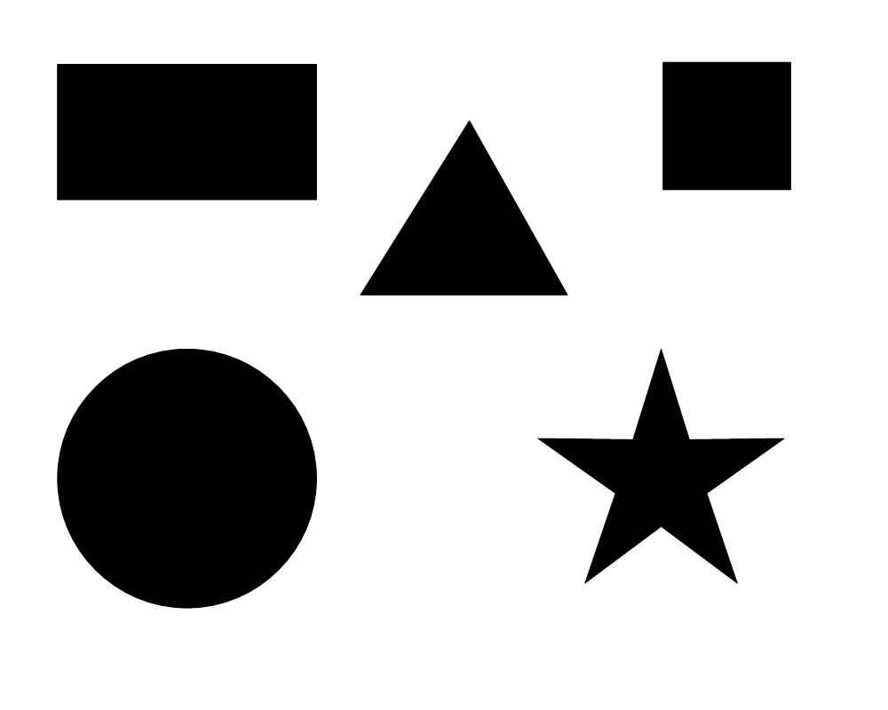

# MaCTG

## Run MaCTG
### Install dependencies
```shell
pip install -r requirements.txt
```
### Create API file
```shell
# in repo folder, create a file containing your own DeepSeek API key
vim deepseek_api
```

### Run MaCTG
```shell
python run_ds.py
```

## Sample Output
Here are some output samples of MaCTG.
| Case_number | Input_image | Requirement                                                                                                                                                                                                                                                                                                                                                                       | Output_image |
|-------------|-------------|-----------------------------------------------------------------------------------------------------------------------------------------------------------------------------------------------------------------------------------------------------------------------------------------------------------------------------------------------------------------------------------|--------------|
| 001         |             | Given an input image ("./squares.jpg"), find all corners of the squares in the image and draw them as red circles(radius=3) on the image. Save the image as "squares_with_corners.png".<br>                                                                                                                                                                                       |              |
| 013         || Given an input image ("./test_image.png") and a face cascade file ("./haarcascade_frontalface_default.xml"), detect the face (only one) in the image and draw a rectangle (in red, thickness=2) around it. Save the resulting image as "face_detected.png".                                                                                                                       ||
| 018         || Given an input image ("./someshapes.jpg"), there is a rectangle, a square, a triangle, a circle and a star in the image. Find these shapes and draw the contours of the shape in different colors (thickness=2): red for the rectangle, green for the square, blue for the triangle, yellow for the circle and pink for the star. Save the resulting image as "shapes_image.png". ||
| 034         || Given an image ("./test_image.png"), apply a circular mask (radius = 100 pixels) and a Gaussian blur (kernel size = 15, sigmaX = 10) outside the mask, keeping the center of the image sharp. Save the resulting image as "final_image.png". ||
| 043         || Given an image ("./test_image.png"), detect faces using Haar cascades (scaleFactor = 1.1, minNeighbors = 5) using "./haarcascade_frontalface_default.xml" and apply Gaussian blur (25x25) to the background, Save the resulting image as "final_image.png". ||
| 051         || Given an image ("./test_image.png"), apply dynamic color filtering based on pixel brightness. For pixels with brightness above a certain threshold = 150, convert the region to grayscale, while leaving the rest of the image untouched. Save the result as "filtered_image.png". ||
| 070         || Given an image ("./test_image.png"), split into R, G, B channels, apply keypoint matching (ORB) to each channel, draw keypoints in red and save the results as "keypoints_R.png", "keypoints_G.png", and "keypoints_B.png". ||
| 073         || Given an image ("./blobs.jpg"), apply a circular mask at the center of the image with a radius of 100 pixels, and detect blobs only within the masked region. Draw the detected blobs (using drawKeypoints) and save the result as "masked_blobs.png". ||
| 089         || Given an input image ("./test_image.png"), create a star-shape watermark and create a robust image watermarking system that embeds a watermark in the frequency domain using Discrete Wavelet Transform (DWT). Save the watermarked image as "./watermarked_image.png". ||